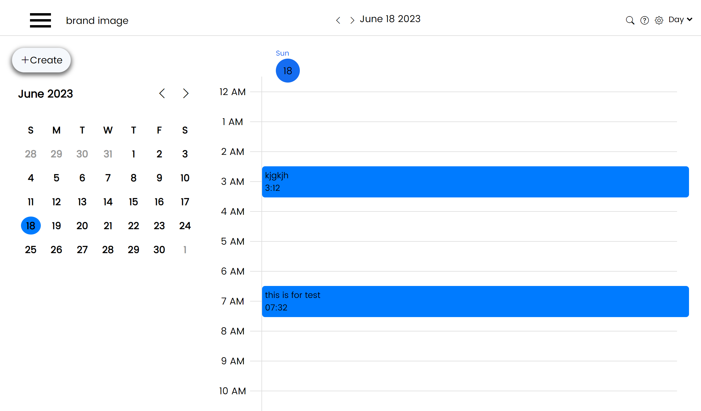
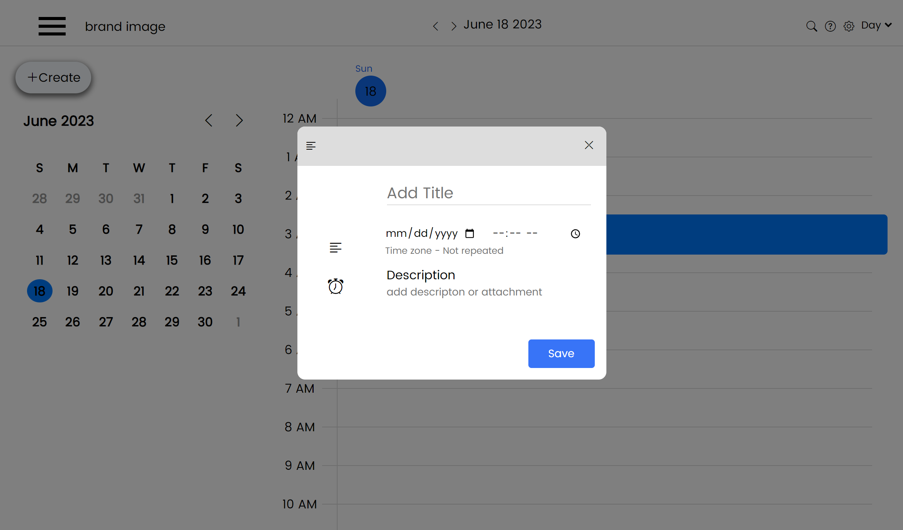

# Calender

## This project is for Payever company Frontend Egineering technical test 

The technical task is to create a simple calender application from scratch. to reduce the implentation time, please make use of Angular Material and the Angular CDK (this is a must)

## The Calender app should consist of:
1. Form to add a calender appointment
2. Ability to delete the appointment
3. Ability to move the appointment
4. Use Date() to work with time/date
5. Implement mouse Drag&Drop using Angular CDK
6. Ngfor to render calender dates and appointments (calender view)

## Therefore its mandatory that you corectly use:
 - Dependency Injection
 - Lazyloadfor module/routes
 - Adding router, router-oputlets, etc
 - Use angular forms, with value changes, validators, etc.
 - Use RXJS in any extent possible
 - Use standalone component and/or shared
 - Angular Materail for styles and Angular CDK is used for DnD

## Home page

## adding appointment form

## Development server

Run `ng serve` for a dev server. Navigate to `http://localhost:4200/`. The application will automatically reload if you change any of the source files.

## Code scaffolding

Run `ng generate component component-name` to generate a new component. You can also use `ng generate directive|pipe|service|class|guard|interface|enum|module`.

## Build

Run `ng build` to build the project. The build artifacts will be stored in the `dist/` directory.

## Running unit tests

Run `ng test` to execute the unit tests via [Karma](https://karma-runner.github.io).

## Running end-to-end tests

Run `ng e2e` to execute the end-to-end tests via a platform of your choice. To use this command, you need to first add a package that implements end-to-end testing capabilities.

